# Часть 4: Работа с группами устройств

## Введение

Давайте подробнее рассмотрим основные функции, необходимые для сценария системы IoT (Интернет вещей) мониторинга температуры.  

Итак, после физического подключения датчика устройства, устройство начинает взаимодействовать с системой и это взаимодействие может быть описано следующим образом:

1. Сенсорное устройство в доме подключается по некоторому протоколу.
2. Компонент, управляющий сетевыми соединениями, принимает соединение.
3. Датчик предоставляет свою группу и идентификатор устройства для регистрации в компоненте диспетчера устройств нашей системы.
4. Компонент диспетчера устройств обрабатывает регистрацию путем поиска или создания "актора", ответственного за сохранение состояния датчика.
5. "Актор" отвечает подтверждением, показывая свой ActorRef.
6. Сетевой компонент теперь использует ActorRef для связи между датчиком и "актором" устройства без использования диспетчера устройств.

Шаги 1 и 2 выходят за рамки учебного примера, поэтому они не рассматриваются далее. В этой главе мы начнем с шагов 3-6 и напишем функции регистрации датчиков в нашей системе и взаимодействия с участниками. Но сначала необходимо определить, сколько уровней акторов мы должны использовать для представления групп устройств и датчиков устройств.

На этапе проектирования требуется выбрать наилучшую детализации для "акторов" и построить модель межакторного взаимодействия, что является очень непростой задачей и ее решение будет в дальнейшем влиять на качество реализации системы. На практике, в зависимости от особенностей взаимодействия между участниками, обычно существует несколько общепринятых подходов к организации "акторов". В нашем сценарии, например, один "актор" может поддерживать все группы и устройства,  возможно, используя хэш-карты. Также было бы разумно создать "актора" для каждой группы, который отслеживает состояние всех устройств в пределах одного дома.

Следующие рекомендации помогают выбрать наиболее подходящую иерархию "акторов":

1. Старайтесь минимизировать число "акторов". Введение большего количества детализированных "акторов", как правило, вызывает больше проблем, чем решает.
2. Высокодетализированные иерархии "акторов" целесообразно применять когда системе требуется:
   - высокий уровень параллелизма;
   - сложные взаимодействие между актерами, имеющими много состояний. В следующей главе мы увидим очень хороший пример такой ситуации;
   - интегрированные состояния, при которых имеет смысл разделить крупных "акторов" на более мелких (выполняющих маленький объем работ или реализующих небольшое число функций);
   - слабая связность подсистем в системе при которой отдельные "акторы" могут аварийно завершать свою работу и восстанавливаться с небольшим влиянием на других "акторов".

## Иерархия диспетчера устройств

Принимая во внимание практические рекомендации, изложенные в предыдущем пункте, модель компонента диспетчера устройств может быть представлена в виде дерева субъектов с тремя уровнями:

1. "Актор" верхнего уровня представляет собой общесистемный компонент для устройств. Это также точка входа для поиска и создания групп устройств и "акторов" устройств.
2. "Акторы" следующего уровня ("акторы" групп устройств) контролирует "акторов" устройства в пределах общего идентификатора группы (например, одного дома). Они также предоставляют доступ к сервисам, таким как запрос показаний температуры со всех доступных устройств в их группе.
3. "Акторы" устройств управляют всеми взаимодействиями с датчиками устройства, например, получение от датчика значения температуры и ее сохранение в логе.

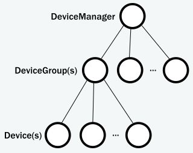

Такая трехуровневая архитектура была выбрана по следующим соображениям:

1. Группы отдельных актеров позволяют:
   - изолировать сбои, возникающие в группе, поскольку если бы один "актор" управлял всеми группами устройств, то ошибка в одной группе, вызывающая перезапуск, уничтожила бы состояние групп, которые исправны.
   - упростить задачу опроса всех устройств, принадлежащих группе, поскольку каждый "актор" группы содержит только состояние, относящееся к его группе.
   - увеличить степень параллелизма в системе, поскольку у каждой группы есть свой выделенный "актор", они работают одновременно, обеспечивая параллельное взаимодействовие с несколькими группами.
2. Моделирование датчиков как отдельных "акторов" устройства, позволяет:
   - изолировать сбои одного "актора" устройства от остальных в группе.
   - повысить параллельность сбора показаний температуры, поскольку сетевые подключения от различных датчиков напрямую связываются со своими индивидуальными "акторами" устройства, уменьшая количество конфликтных точек.

Определив архитектуру, на следующем шаге необходимо реализовать протокол регистрации датчиков.

## Протокол регистрации

Прежде всего необходимо разработать протокол для регистрации устройства, для создания группы и "акторов" устройства, которые будут за него отвечать. Этот протокол будет предоставлен самим компонентом `DeviceManager`, потому что это единственный известный и доступный заранее действующий "актор": группы устройств и субъекты устройств создаются по запросу.

Далее представлен функционал системы, требуемый на этапе регистрации устройства:

1. Когда DeviceManager получает запрос с идентификаторами группы и устройства:
   - Если у менеджера уже есть "актор" для группы устройств, он пересылает ему запрос.
   - В противном случае он создает нового "актора" группы устройств и затем пересылает ему запрос.
2. "Актор" DeviceGroup получает запрос на регистрацию "актора" для конкретного устройства:
   - Если в группе уже есть "актор" для устройства, то возвращается ответ, содержащий ActorRef существующего "актора" устройства.
   - В противном случае "актор" DeviceGroup сначала создает "актора" устройства и возвращает ответ, содержащий ActorRef вновь созданного "актора" устройства.
3. У сенсора теперь будет ActorRef "актора" устройства для отправки сообщений непосредственно ему.

Сообщения, которые мы будем использовать для передачи запросов на регистрацию и их подтверждения, программируются следующим образом:

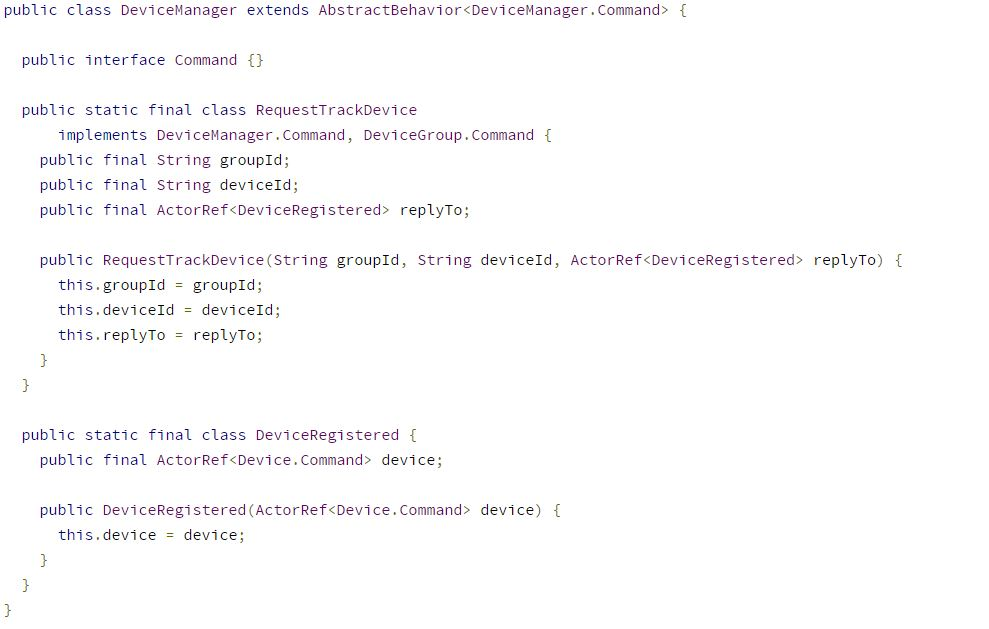

В этом случае мы не включили поле идентификатора запроса в сообщения. Поскольку регистрация происходит один раз, когда компонент подключается к системе по сетевому протоколу, идентификатор не важен. Однако обычно рекомендуется добавлять идентификатор запроса.

Реализации протокола проводится снизу вверх. На практике могут применяться как нисходящий, так и восходящий подходы, но в рассматриваемом примере подход снизу-вверж более эффективен, поскольку он позволяет нам писать тесты для новых функций, не создавая "заглушек" для функциональности, которая нам понадобится позже.

## Добавление поддержки регистрации для участников группы устройств

При регистрации "актора" группы выполняются следующие действия:

1. Обработка запроса на регистрацию уже существующего "актора" устройства или создание нового "актора".
2. Отслеживание "акторов" в группе устройств и удаление их из группы, когда они завершают работу.

#### Обработка запроса на регистрацию

"Актор" группы устройств должен либо вернуть ответ, содержащий `ActorRef` существующего дочернего элемента, либо создать его. Для поиска дочерних "акторов" по идентификаторам устройств используется `Map`.

С учетом этого, программный код системы изменится следующим образом:

Далее, необходимо выполнить тестирование новой функциональности и, в том числе, 

- проверить, что "акторы", возвращенные для двух разных идентификаторов, на самом деле разные;
- записать показания температуры для каждого из устройств, чтобы увидеть, отвечают ли "акторы".

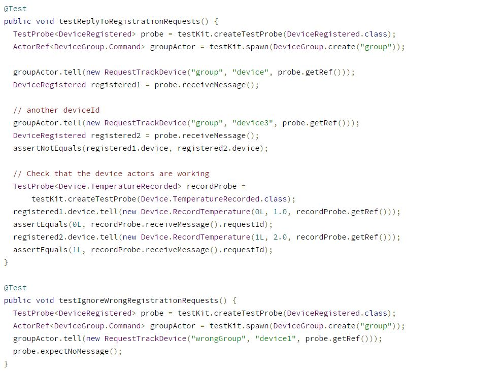

Если при запросе на регистрацию выясняется, что "актор" устройства уже существует, следует использовать ранее созданного. Ниже приведен код теста этой функциональности:

#### Отслеживание "акторов" устройства в группе

До этого момента была реализована логика для регистрации "акторов" устройств  в группе. Однако устройства добавляются и уничтожаются, поэтому требуется реализовать удаление "акторов" устройств из `Map <String, ActorRef <DeviceMessage>>`. Предположим, что при удалении устройства его соответствующий "актор" останавливается и необходимо уведомить родительского "актора", когда один из "акторов" устройства остановлен.

**Akka** предоставляет функцию `*Death Watch*`, которая позволяет "актору" наблюдать за состоянием других "акторов" и получать уведомления, если один из них остановлен. В отличие от *отслеживания*, *наблюдение* не ограничивается отношениями родитель-потомок, любой "актор" может наблюдать за любым другим "актором", если ему известен их `ActorRef`. 

После того, как наблюдаемый "актор" останавливается, наблюдатель получает сигнал `Terminated (ActorRef)`, который также содержит ссылку на наблюдаемого "актора". Наблюдатель может либо обработать это сообщение явно, либо завершится с ошибкой с `DeathPactException`. Последнее полезно, если "актор"-наблюдатель больше не может выполнять свои собственные обязанности после остановки наблюдаемого "актора". В нашем случае группа по-прежнему должна работать после остановки одного устройства, поэтому требуется написать обработчик сигнала `Terminated (actorRef)`.

Итак, "актор" группы устройств должен включать в себя следующие функции:

- при создании новых "акторов" устройств, должен начать наблюдать ними;
- удаление "актора" устройства из `Map <String, ActorRef <DeviceMessage>>`, который сопоставляет устройства "акторам" устройств, когда в уведомлении указывается, что "актор" устройства остановлен.

К сожалению, сигнал `Terminated` содержит только `ActorRef` "актора"-потомка. Нам нужен идентификатор "актора", чтобы удалить его из `Map <String, ActorRef <DeviceMessage>>`. Альтернативой сигналу `Terminated` является настраиваемое сообщение, которое будет отправлено при остановке наблюдаемого "актора". Ниже представлена конфигурация настраиваемого сообщения, используемого для переноса идентификатора устройства:

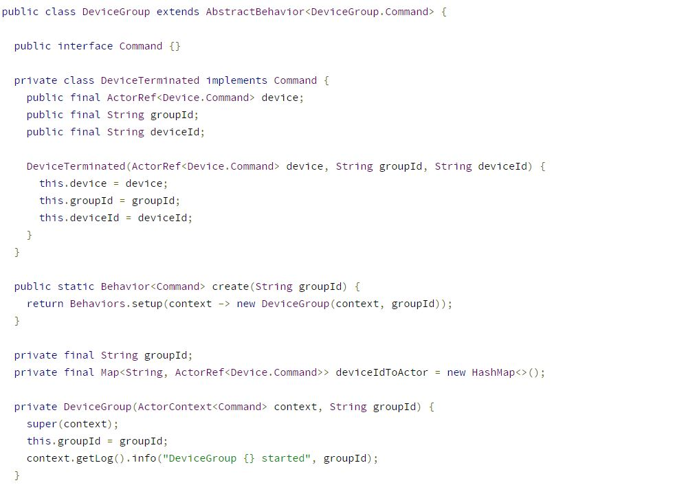

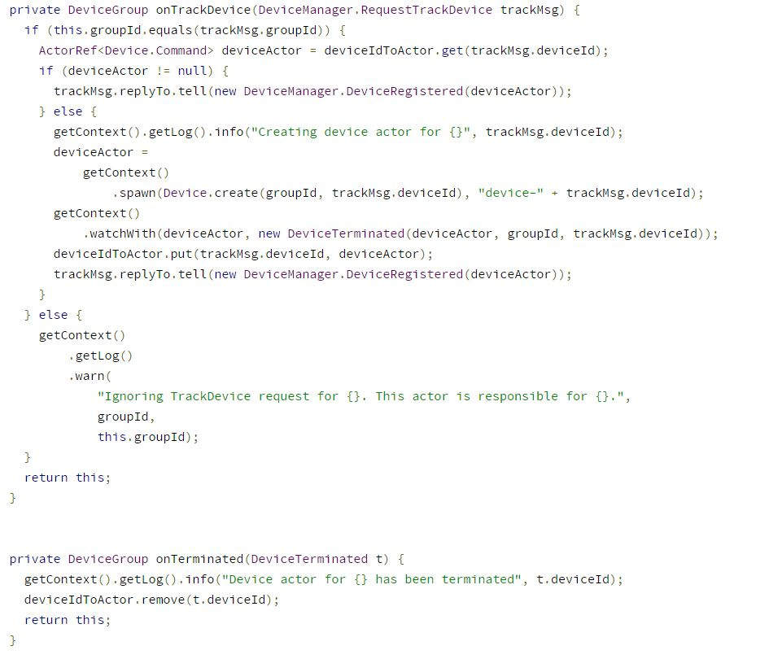

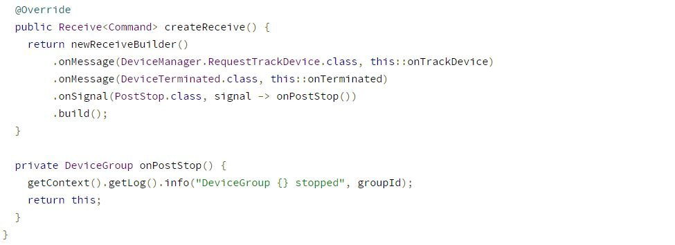

На следующем шаге необходимо реализовать средства, позволяющие узнать, какие устройства отслеживает "актор" группового устройства. Это будет использоваться при написании тестов новой функциональности. Ниже представлена реализация сообщения `RequestDeviceList`, в котором перечислены текущие активные идентификаторы устройств:

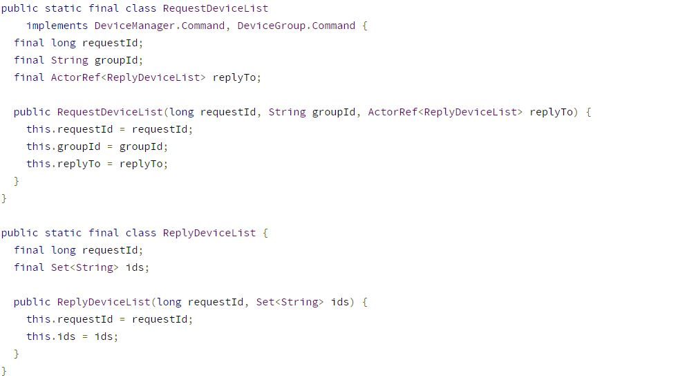

Ниже представлена соответсвтующая модификация ранее написанного программного кода:

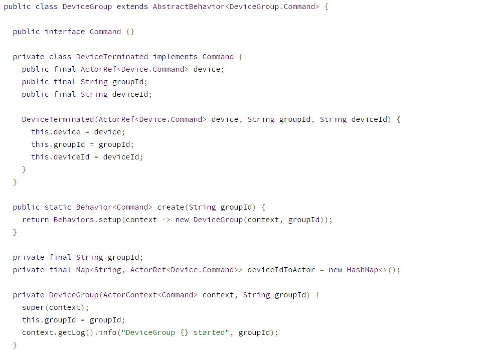

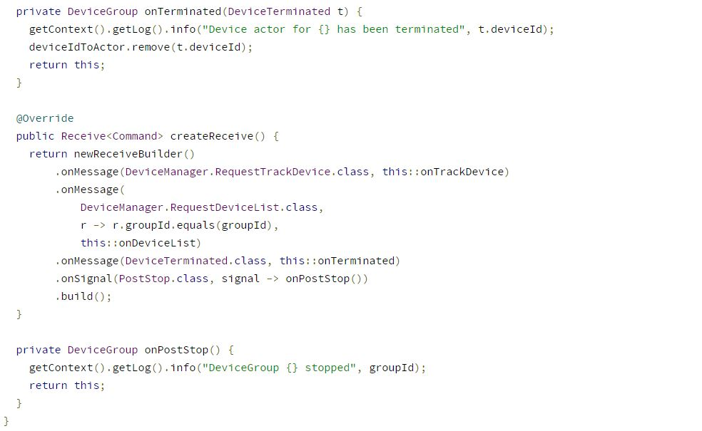

Перед написанием тестов, необходимо реализовать еще несколько возможностей системы:

возможность извне остановить "актора" устройства, описанного в тестовом примере, необходимо отправить ему сообщение, Passivate, которое инструктирует "актора" остановиться.
возможность получать уведомления после остановки "актора" устройства, для этой цели используются средства `Death Watch`.

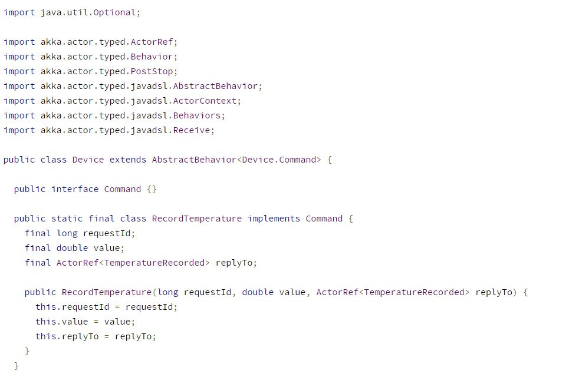

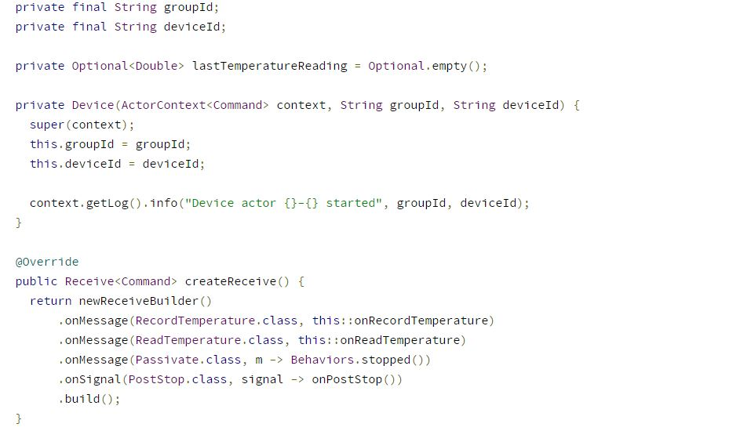

Далее добавлены два тестовых кейса:

- проверка, корректности списка идентификаторов после добавления нескольких устройств;
- проверка корректности удаления идентификатора устройства после остановки "актора" устройства. 

`TestProbe` имеет метод `expectTerminated,` который применяется для формирования утверждения о том, что  "актор" устройства был отключен.

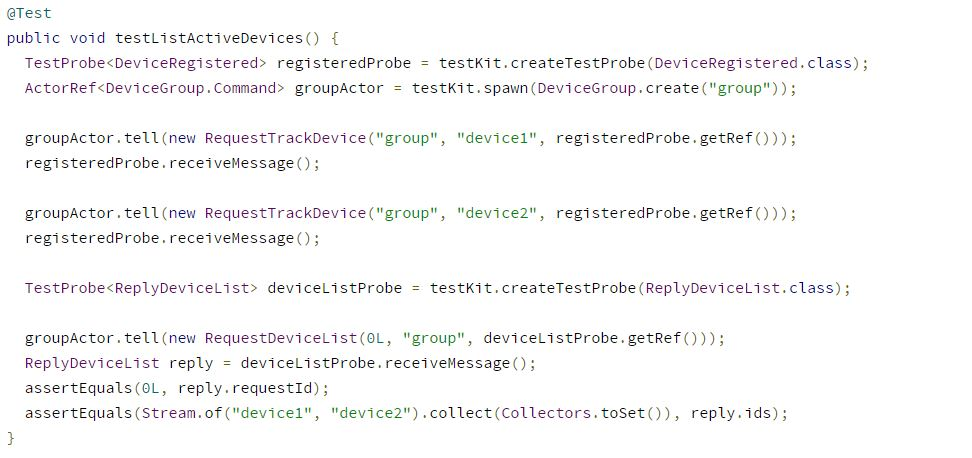

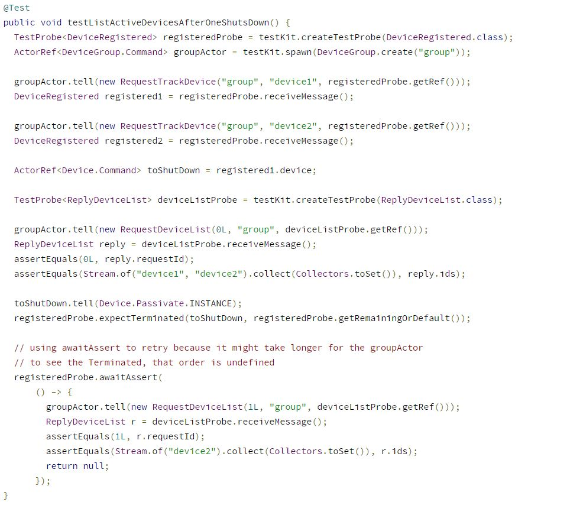

## Создание "акторов" диспетчера устройств

На следующем уровне в иерархии "акторов", необходимо создать точку входа компонента диспетчера устройств в исходном файле `DeviceManager`. Этот "актор" подобен "актору" группы устройств, но при этом создает "актора" группы устройств, а не "актора" устройств:

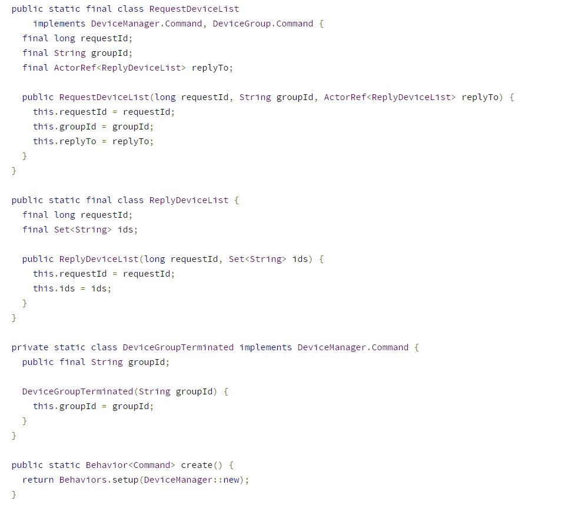

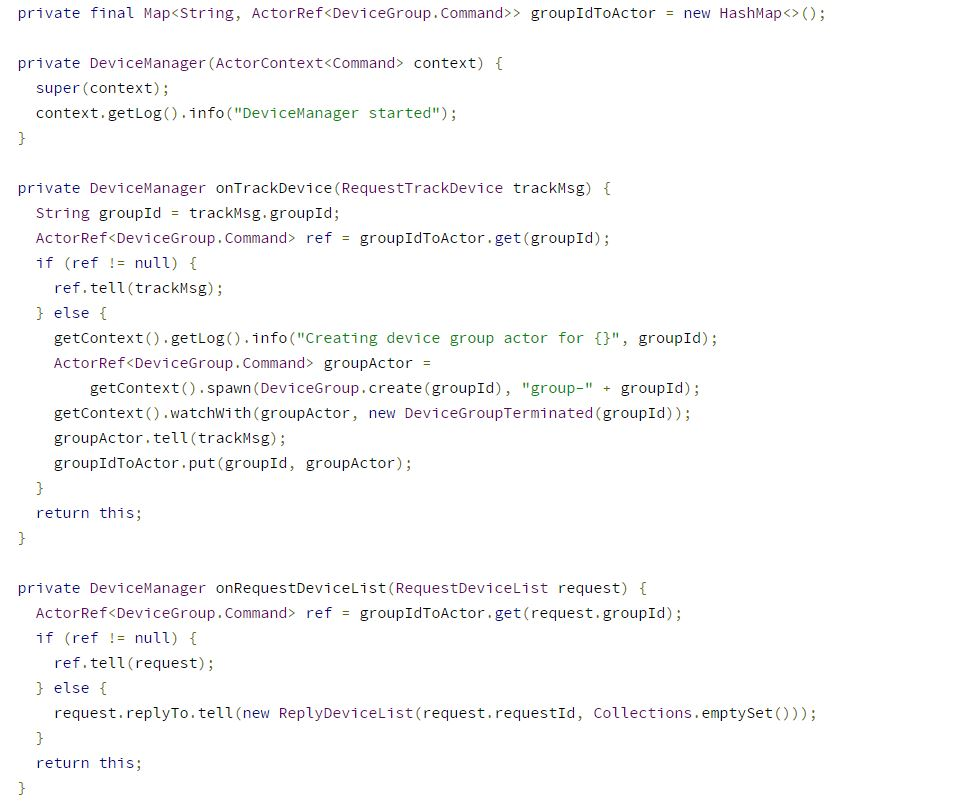

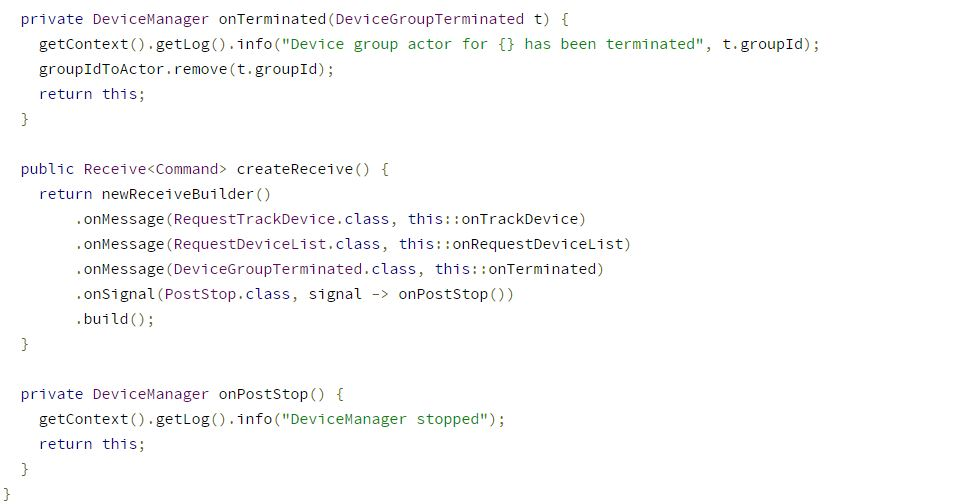

В качестве упражнения напишите тесты диспетчера устройств, они очень похожи на тесты "акторов" группы.

# Что дальше?

На текущем шаге реализован иерархический компонент для регистрации и отслеживания устройств и записи измерений. Было показано, как реализовать различные типы шаблонов обмена сообщениями, таких как:

- `Request-respond` Запрос-ответ (для регистрации температуры)
- `Create-on-demand` Создание по запросу (для регистрации устройств)
- `Create-watch-terminate` Создание-отслеживаие-удаление (для создания "акторов" группы и устройства в качестве дочерних элементов)

В следующей главе мы познакомимся с возможностями групповых запросов, и соответствующего протокола взаимодействия (шаблон разговора) В частности, будет реализована функциональность, которая позволяет пользователям запрашивать статус всех устройств, принадлежащих группе.