# Часть 5: Запрос групп устройств

## Введение

Рассмотренные паттерны переговоров просты, в том смысле, что они требуют от "актора" сохранения части данных о своем состоянии или же могут не требовать ничего. В частности:

1. "Акторы" устройства доступны для чтения, при этом не требуется изменение их состояния.
2.  При записи значения температуры обновляется одно поле данных.
3.  "Акторы" группы устройств поддерживают членство в группе, редактируя информацию о новых и завершивших свои действия "акторах" устройств.

Далее будет реализован более сложный сценарий. Поскольку домовладельцев будет интересовать температура в их доме, требуется опрашивать всех "акторов" устройства в группе. В следующем пункте показано проектирование API такой системы.

## Работа с возможными сценариями

Ранее отмечалось, что членство "актора" в группе динамично, каждое сенсорное устройство  связано с "актором", который может остановиться в любой момент. Запрос температуры у всех действующих "акторов" не всегда может быть реализован, поскольку во время жизненного цикла запроса:

1. "Актор" устройства может остановиться и не сможет ответить показанием температуры.
2. Новый "актор" устройства может выполнятся, но при этом данные о нем могут быть не доступны.

Существует множество подходов к решению этой проблемы, рассмотрим один из вариантов, подходящий под наш сценарий:

1. Когда поступает запрос, "актор" группы делает снимок существующих субъектов устройства и запрашивает температуру только у них.
2. "Акторы", которые запускаются после поступления запроса, игнорируются.
3. Если "актор", попавший в снимок, останавливается во время запроса, не отвечая, то система сообщает об этом отправителю сообщения запроса.

Помимо того, что "акторы" устройства регистрируются и уничтожаются динамически, разным "акторам" требуется разное время, чтобы ответить. Например, они могут случайно застрять в бесконечном цикле или выйти из строя из-за ошибки и проигнорировать запрос температуры. Для избежания бесконечного времени выполнения запроса вводятся правила, определяющие момент завершения:

1. Все "акторы" снимка либо ответили, либо подтвердили, что их остановили.
2. Достигнуто предельное значение времени (тайм-аут) обработки запроса.

Принимая во внимание эти решения, а также тот факт, что устройство на снимке состояния могло только что запуститься и еще не получило температуру для записи, определяются четыре состояния для каждого "актора" устройства в отношении запроса температуры:

1. "Актору" доступно значение температуры: `Temperature`.
2. "Актор" ответил, но пока нет данных о температуре: `TemperatureNotAvailable`.
3. "Актор" остановился до ответа (не доступен): `DeviceNotAvailable`.
4. "Актор" не ответил в пределах указанного тайм-аута: `DeviceTimedOut`.

С учетом этого обобщения протокол сообщений выглядит следующим образом:

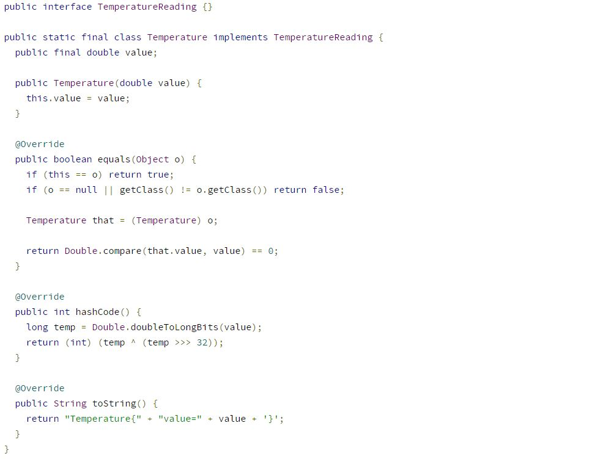

## Реализация запроса

Один из подходов заключается в добавлении кода проверки запроса к "актору" группового устройства, однако на практике это приводит к появлению сильно связанного программного кода, к возрастанию накладных расходов на его сопровождение, не говоря   о появлении новых и, зачастую, трудно отслеживаемых ошибок.  Для каждого нового запроса необходимо сделать снимок присутствующих устройств и запустить таймер для отследивания тайм-аута. 

Более практичный вариант. Создается "актор", представляющий один запрос и выполняющий задачи, необходимые для выполнения запроса от имени группового субъекта. До сих пор все созданные "акторы" были связаны с объектам предметной области. Далее создадим "акторов", которые представляют процесс или задачу, а не сущность предметной области. Архитектура системы остается простой, хорошо масштабируемой, при этом обеспечивается возможность изолированного тестирования запроса.

#### Определение субъекта запроса

Итак, жизненный цикл "актора" запроса состоит из определения его начального состояния, первого действия, которое он предпримет, и его уничтожения при необходимости. "Актору" запроса потребуется следующая информация:

1. Снимок и идентификаторы активных "акторов" устройства для обработки запроса.
2. Идентификатор "актора", определяющего спецификацию запроса и выполняющий различные проверки, (для включения его в ответ).
3. Ссылка на "актор", отправившего запрос, для обеспечения возможности ответа ему напрямую.
4. Тайм-аут, указывающий, как долго "актор" запроса должен ждать ответов. Создание этого параметра упростит тестирование.

#### Планирование тайм-аута запроса

Для настройки тайм-аута применяется встроенный планировщик `Akka`. Методы `Behaviors.withTimers` и `startSingleTimer` используются для планирования сообщения, которое будет отправлено после указанного тайм-аута.

Простое сообщение без параметров `CollectionTimeout` представляет тайм-аут запроса.

В начале запроса необходимо спросить у каждого из участников устройства текущую температуру. Чтобы иметь возможность быстро обнаруживать устройства, которые остановились до того, как получили сообщение `ReadTemperature`, требуется наблюдать за каждым из "акторов". Сообщения `DeviceTerminated` позволяет пометить устройства, останавившиеся в течение времени существования запроса, как недоступные.

Теперь код "актора" `DeviceGroupQuery` выглядит следующим образом:

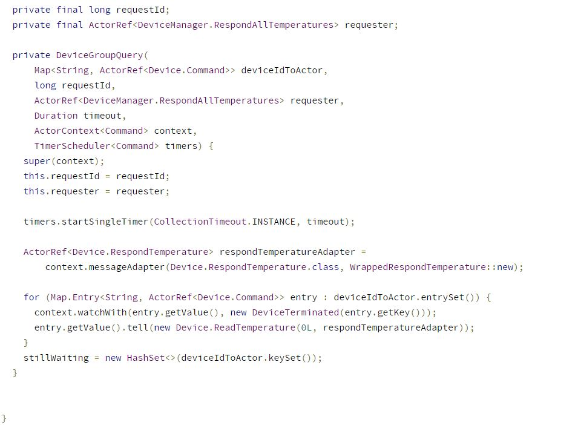

Обратите внимание, что мы должны преобразовать ответы `RespondTemperature` от "актора" устройства в протокол сообщений, который понимает субъект `DeviceGroupQuery`, то есть `DeviceGroupQueryMessage`. Для этого применяется `messageAdapter`, который обертывает `RespondTemperature` в `WrappedRespondTemperature`, который, в свою очередь, реализует `DeviceGroupQueryMessage`.

#### Отслеживание состояния актера

У "актора" запроса, помимо таймера ожидания, также необходимо отслеживать состояния "акторов", которые: ответили, остановились или не ответили. Состояние "акторов" фиксируем в `HashMap` в "акторов".

Для рассматриваемого кейса:

1. Состояние отслеживается с помощью:
   - Карты уже полученных ответов
   - Набора "акторов", которых мы все еще ждем
2. Три события, по которым нужно действовать:
   - Получение сообщения `RespondTemperature` от одного из устройств.
   - Получение сообщения `DeviceTerminated` для  устройства, которое было остановлено в процессе обработки запроса.
   - Получение сообщение `CollectionTimeout` о таймауте.

Для этого добавьте в исходный файл `DeviceGroupQuery` следующее:

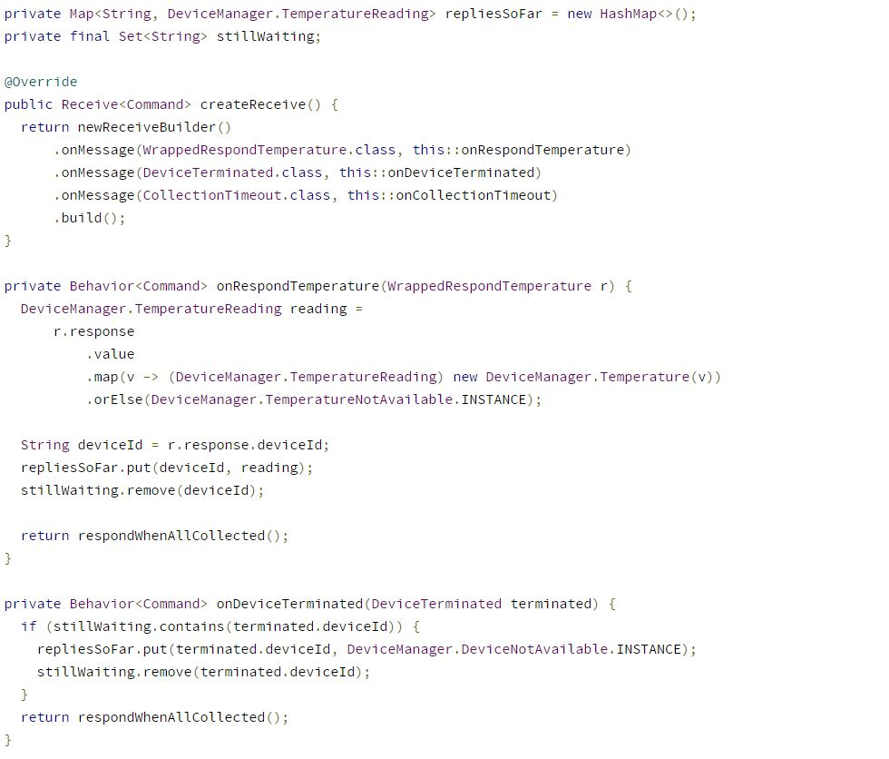

Для `RespondTemperature` и `DeviceTerminated` необходимо отслеживать ответы, обновляя `responseSoFar` и удаляя "актора" из `stillWaiting`. Для этого мы можем использовать идентификатор "актора", уже присутствующий в сообщении `DeviceTerminated`. Для сообщения `RespondTemperature` введем новую информацию:

и

То, что происходит после обработки каждого сообщения, делегируется методу `responseWhenAllCollected`, который будет рассмотрен дальше.

В случае тайм-аута необходимо взять всех "акторов", которые еще не ответили (члены набора `stillWaiting`), и поместить `DeviceTimedOut` в качестве статуса в окончательный ответ.

Внутри метода`responseWhenAllCollected`реализуется:

1. запись нового результата в карту `answersSoFar` и удаление "актора" из `stillWaiting`. 
2. проверка того, есть ли еще какие-нибудь не ответившие "акторы",  и если таких нет, то происходит отправка результата запроса исходному инициатору запроса, остановка "актора" запроса. 
3. если такие есть, то необходимо обновить структуры `repliesSoFar` и `stillWaiting` и дождаться новых сообщений.

Ниже представлена реализация метода `responseWhenAllCollected`:

Наш субъект запроса готов:

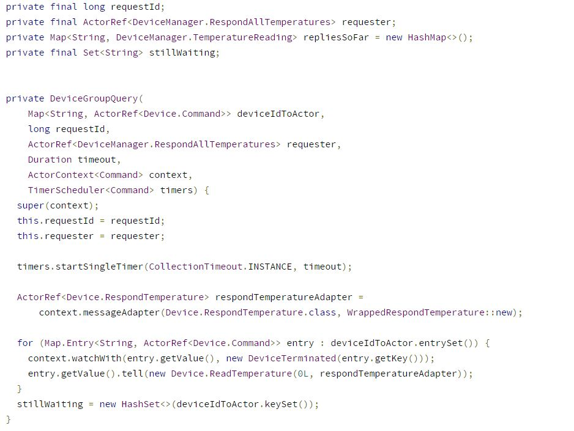

#### Тестирование субъекта запроса

Теперь давайте проверим правильность реализации "актора" запроса. Существуют различные сценарии, которые необходимо протестировать индивидуально, чтобы убедиться, что все работает должным образом. Чтобы иметь возможность это сделать, необходимо смоделировать акторов устройства для отработки  сценариев рабочего режима или сценариев сбоя. В первом тесте проверяется случай, когда два устройства сообщают температуру:

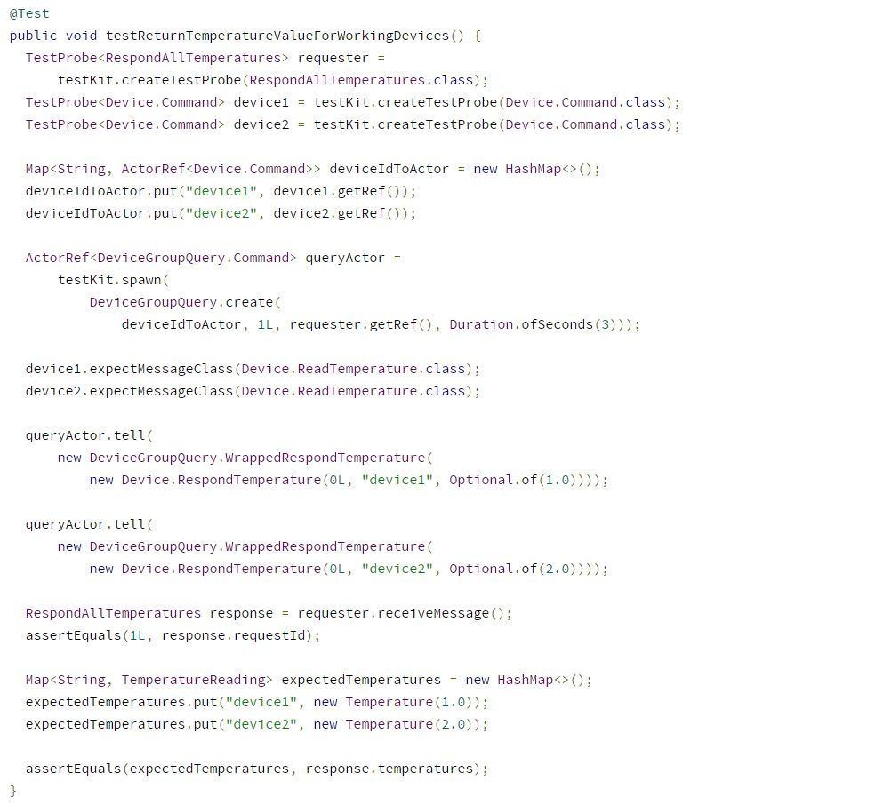

Это была работа в штатном режиме, но иногда устройства не могут обеспечить измерение температуры, и для тестирования такого сценария внесем коррективы в код теста:

Иногда "акторы" устройства останавливаются, прежде чем ответить:

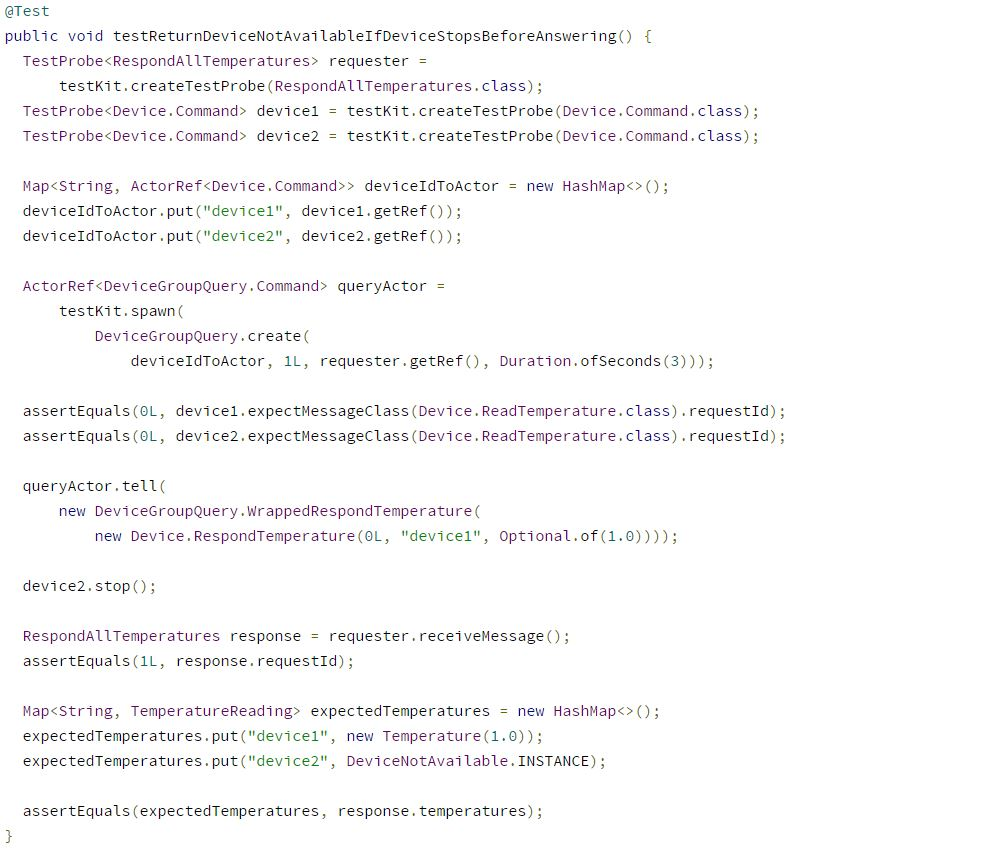

Имеется еще случай, связанный с остановкой "акторов" устройств. Возможно, изначально будет получен ответ со значением температуры от "актора" устройства, но позже возможна ситуация с ответом `Terminated` для того же "актора". В этом случае мы хотели бы сохранить первый ответ и не отмечать устройство как `DeviceNotAvailable`. Ниже приведен код теста, позволяющий проверить этот сценарий:

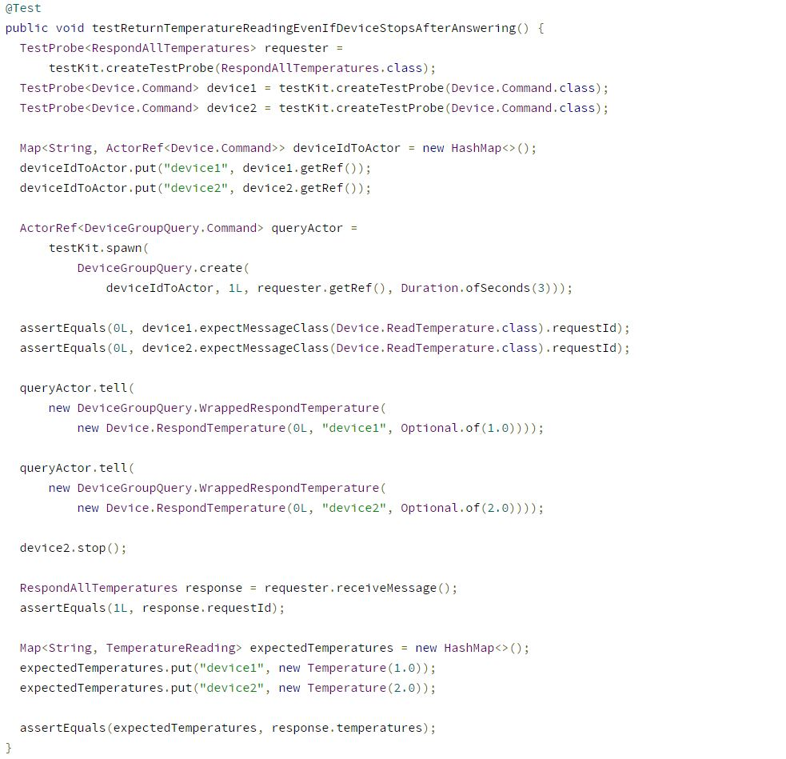

Последний случай - когда не все устройства отвечают вовремя. Чтобы тест оставался относительно быстрым, был создан "актор"  `DeviceGroupQuery` с меньшим таймаутом:

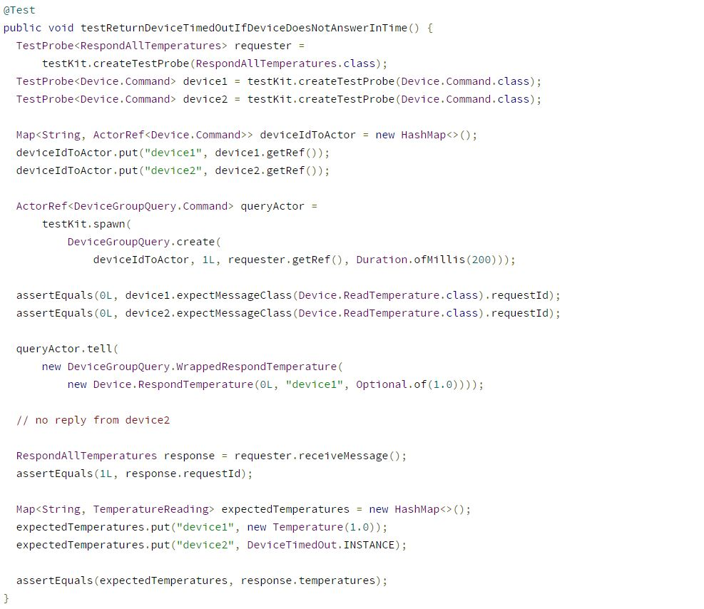

Теперь запрос работает так, как ожидалось.

#### Добавление возможности запроса в группу

Включить функцию запроса в "актор" группы довольно просто. Выше была проделана вся тяжелая работа с "актором" запроса, "актору" группы нужно только создать его с правильными начальными параметрами и ничего больше.

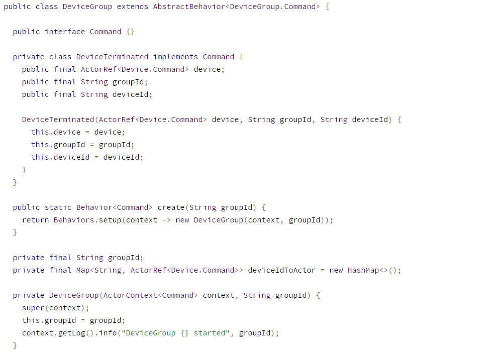

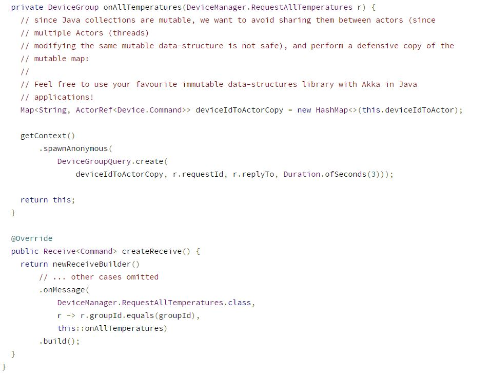

Сохраняя временное состояние, которое имеет отношение только к самому запросу, в отдельном "акторе", реализация группового "актора" будет очень простой. Он делегирует всем дочерним "акторам" и, следовательно, не должен сохранять состояние, которое не имеет отношения к его основному процессу. Кроме того, несколько запросов теперь могут выполняться параллельно друг другу, фактически столько, сколько необходимо. В нашем случае запрос к отдельному субъекту устройства - это быстрая операция, но если бы это было не так, например, из-за того, что с удаленными датчиками необходимо связываться по сети, такая конструкция значительно улучшила бы пропускную способность.

Мы завершаем эту главу проверкой функции группового запроса:

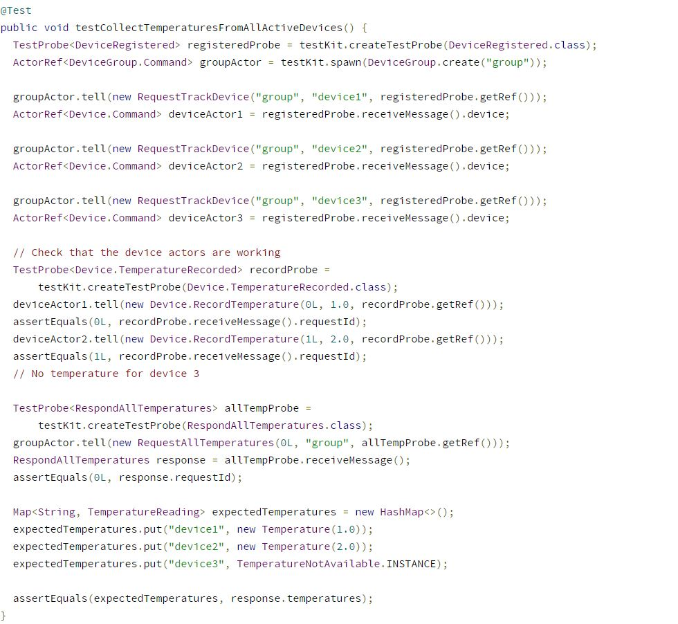

## Резюме

В контексте системы IoT были рассмотрены:

1. Иерархия "акторов" и их жизненный цикл.
2.  "Акторы" сообщений, обеспечивающие гибкость и слабую связность кода.  
3. Отслеживание и остановка "акторов" при необходимости.

